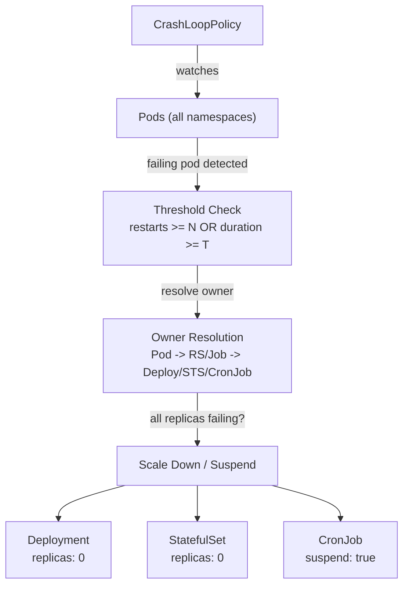

# crashloop-operator

[](https://github.com/slauger/crashloop-operator/actions/workflows/ci.yaml)
[](https://goreportcard.com/report/github.com/slauger/crashloop-operator)
[](https://pkg.go.dev/github.com/slauger/crashloop-operator)
[](LICENSE)

A Kubernetes Operator that watches pods for terminal failure states and scales down (or suspends) the owning workload after configurable thresholds are exceeded. Prevents resource waste and alert fatigue from permanently broken deployments.

- **CrashLoopBackOff Detection** - Catches pods stuck in CrashLoopBackOff, ImagePullBackOff, ErrImagePull, and other terminal states
- **Workload Scale-Down** - Scales Deployments and StatefulSets to zero, suspends CronJobs
- **Configurable Thresholds** - Restart count and duration thresholds before action is taken
- **All-Replicas Check** - Only acts when all replicas of a workload are failing (configurable)
- **Namespace Exclusions** - Skip critical namespaces like kube-system
- **Dry Run Mode** - Log what would happen without actually scaling down
- **Kubernetes Events** - Emits events explaining why a workload was scaled down
- **Annotations** - Records reason, timestamp, and previous replica count on scaled-down workloads

> **Status: Early Development** - This project is experimental and under active development. CRDs, APIs, and behavior may change at any time. Feedback is welcome via [issues](https://github.com/slauger/crashloop-operator/issues).

## Why?

Kubernetes has no built-in mechanism to stop retrying workloads that are permanently broken. Pods stuck in `CrashLoopBackOff`, `ImagePullBackOff`, or similar terminal states keep consuming resources and generating noise indefinitely.

Existing tools don't solve this:
- **pod-reaper** only kills individual pods (which get recreated by the controller)
- **descheduler** has an [open feature request](https://github.com/kubernetes-sigs/descheduler/issues/932) but no implementation

The crashloop-operator watches for these failure patterns and scales down the owning workload after configurable thresholds, preserving the previous replica count in an annotation for easy recovery.

## Architecture



The controller reconciles on a configurable interval (default: 60s) and on pod events. For each failing pod, it:

1. Checks if the failure reason matches the watch list
2. Verifies restart count or duration exceeds the threshold
3. Resolves the owner chain (Pod -> ReplicaSet/Job -> Deployment/StatefulSet/CronJob)
4. Optionally checks if ALL replicas are failing
5. Scales down the workload and annotates it with the reason

## CRD

The operator introduces a single CRD: **`CrashLoopPolicy`** (`crashloop-operator.lauger.de/v1alpha1`).

| Field | Default | Description |
|---|---|---|
| `watchReasons` | `[CrashLoopBackOff, ImagePullBackOff, ErrImagePull, CreateContainerConfigError, InvalidImageName, RunContainerError]` | Container waiting reasons to watch |
| `restartThreshold` | `10` | Number of container restarts before action |
| `durationThreshold` | `30m` | How long a pod must be failing before action |
| `allReplicasFailing` | `true` | Require all replicas to be failing |
| `targets` | `[Deployment, StatefulSet, CronJob]` | Workload types to act on |
| `excludeNamespaces` | `[kube-system]` | Namespaces to ignore |
| `dryRun` | `false` | Log actions without executing them |

## Quick Start

### 1. Install the Operator

```bash
helm install crashloop-operator \
  oci://ghcr.io/slauger/charts/crashloop-operator \
  --namespace crashloop-system \
  --create-namespace
```

### 2. Create a Policy

```yaml
apiVersion: crashloop-operator.lauger.de/v1alpha1
kind: CrashLoopPolicy
metadata:
  name: default
  namespace: default
spec:
  restartThreshold: 10
  durationThreshold: "30m"
  allReplicasFailing: true
  excludeNamespaces:
    - kube-system
```

### 3. Recover a Scaled-Down Workload

When the operator scales down a workload, it stores the previous replica count in an annotation:

```bash
# Check what happened
kubectl get deployment my-app -o jsonpath='{.metadata.annotations}'

# Restore the original replica count
kubectl scale deployment my-app --replicas=$(kubectl get deployment my-app -o jsonpath='{.metadata.annotations.crashloop-operator\.lauger\.de/previous-replicas}')
```

## Annotations

When a workload is scaled down, the operator adds these annotations:

| Annotation | Description |
|---|---|
| `crashloop-operator.lauger.de/scaled-down-reason` | Human-readable reason for the scale-down |
| `crashloop-operator.lauger.de/scaled-down-at` | RFC3339 timestamp of when the scale-down occurred |
| `crashloop-operator.lauger.de/previous-replicas` | Previous replica count (Deployments and StatefulSets only) |

## Local Development

```bash
make generate manifests   # Regenerate deepcopy + CRD YAML + Helm CRDs
make build                # Build operator binary
make test                 # Run unit tests
make ci                   # Full CI: lint + test + helm-lint + check-manifests
make docker-build         # Build container image
```

## Supply Chain Security

All container images are:

- **Signed** with [cosign](https://docs.sigstore.dev/cosign/) keyless signing (Sigstore OIDC)
- **Attested** with [SLSA provenance](https://slsa.dev/) via `docker/build-push-action`
- **SBOM** generated and attached to each image

Verify image signatures:

```bash
cosign verify ghcr.io/slauger/crashloop-operator:latest \
  --certificate-oidc-issuer https://token.actions.githubusercontent.com \
  --certificate-identity-regexp 'github\.com/slauger/crashloop-operator'
```

## License

Apache License 2.0
