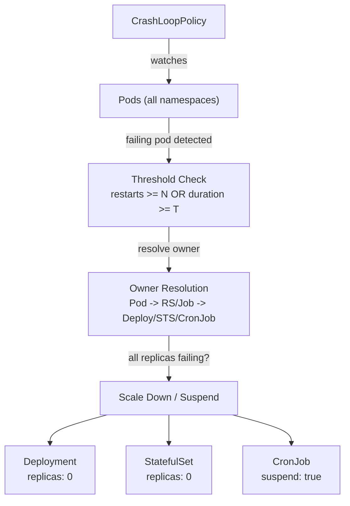

# crashloop-operator

[](https://github.com/slauger/crashloop-operator/actions/workflows/ci.yaml)
[](https://goreportcard.com/report/github.com/slauger/crashloop-operator)
[](https://pkg.go.dev/github.com/slauger/crashloop-operator)
[](LICENSE)

A Kubernetes Operator that watches pods for terminal failure states and scales down (or suspends) the owning workload after configurable thresholds are exceeded. Prevents resource waste and alert fatigue from permanently broken deployments.

- 🔄 **CrashLoopBackOff Detection** - Catches pods stuck in CrashLoopBackOff, ImagePullBackOff, ErrImagePull, and other terminal states
- 📉 **Workload Scale-Down** - Scales Deployments and StatefulSets to zero, suspends CronJobs
- ⏱️ **Configurable Thresholds** - Restart count and duration thresholds before action is taken
- 🔍 **All-Replicas Check** - Only acts when all replicas of a workload are failing (configurable)
- 🛡️ **Namespace Filtering** - Label-based namespace selector and explicit exclusion list
- 🚫 **Workload Exclusion** - Exclude workloads via label selector
- 🧪 **Dry Run Mode** - Log what would happen without actually scaling down
- 📢 **Kubernetes Events** - Emits events explaining why a workload was scaled down
- 🏷️ **Annotations** - Records reason, timestamp, and previous replica count on scaled-down workloads

> **Status: Early Development** - This project is experimental and under active development. CRDs, APIs, and behavior may change at any time. Feedback is welcome via [issues](https://github.com/slauger/crashloop-operator/issues).

## Why?

Kubernetes has no built-in mechanism to stop retrying workloads that are permanently broken. Pods stuck in `CrashLoopBackOff`, `ImagePullBackOff`, or similar terminal states keep consuming resources and generating noise indefinitely.

The crashloop-operator watches for these failure patterns and scales down the owning workload after configurable thresholds, preserving the previous replica count in an annotation for easy recovery.

## Architecture


```mermaid
graph TD
    Policy["CrashLoopPolicy"]
    Policy -->|watches| Pods["Pods (all namespaces)"]
    Pods -->|failing pod detected| Check["Threshold Check<br/>restarts >= N OR duration >= T"]
    Check -->|resolve owner| Owner["Owner Resolution<br/>Pod -> RS/Job -> Deploy/STS/CronJob"]
    Owner -->|all replicas failing?| Scale["Scale Down / Suspend"]
    Scale --> Deploy["Deployment<br/>replicas: 0"]
    Scale --> STS["StatefulSet<br/>replicas: 0"]
    Scale --> CJ["CronJob<br/>suspend: true"]
```

The controller reconciles on a configurable interval (default: 60s) and on pod events. For each failing pod, it:

1. Checks if the failure reason matches the watch list
2. Verifies restart count or duration exceeds the threshold
3. Resolves the owner chain (Pod -> ReplicaSet/Job -> Deployment/StatefulSet/CronJob)
4. Optionally checks if ALL replicas are failing
5. Scales down the workload and annotates it with the reason

## CRD

The operator introduces a single CRD: **`CrashLoopPolicy`** (`crashloop-operator.lauger.de/v1alpha1`).

`CrashLoopPolicy` is **cluster-scoped**. A policy evaluates workloads across the
whole cluster, so it is an administrative resource: grant write access to it the
same way you would grant any other cluster-wide permission. Use
`namespaceSelector` and `excludeNamespaces` to limit which namespaces a policy
acts on, and the chart's `scope.mode` to confine the operator itself to a single
namespace.

Short name: `clp` (`kubectl get clp`).

### Spec

| Field | Default | Description |
|---|---|---|
| `watchReasons` | `[CrashLoopBackOff, ImagePullBackOff, ErrImagePull, CreateContainerConfigError, InvalidImageName, RunContainerError]` | Container waiting reasons to watch |
| `restartThreshold` | `10` | Number of container restarts before action |
| `durationThreshold` | `30m` | How long a pod must be failing before action. Go duration format, rejected by the API server if malformed |
| `allReplicasFailing` | `true` | Require all replicas to be failing |
| `targets` | `[Deployment, StatefulSet, CronJob]` | Workload types to act on. Only these three values are accepted |
| `namespaceSelector` | `nil` | Label selector for namespaces to watch (nil = all) |
| `excludeNamespaces` | `[kube-system, kube-public, kube-node-lease]` | Namespaces to ignore (applied after namespaceSelector) |
| `excludeWorkloadSelector` | `nil` | Label selector to exclude matching workloads from scale-down |
| `reconcileInterval` | `60s` | How often the policy is evaluated. Same duration format as `durationThreshold` |
| `dryRun` | `false` | Log actions without executing them |

### Status

| Field | Description |
|---|---|
| `phase` | `Pending` before the first evaluation, `Active` afterwards |
| `observedGeneration` | Generation of the spec that was last evaluated |
| `conditions` | `Ready` reports whether the last evaluation succeeded. `Degraded` is true while any workload is held scaled down |
| `scaledDownWorkloads` | Lifetime counter of scale-down actions performed by this policy |
| `activeScaledDown` | Workloads currently held at zero replicas (or suspended), as `kind`/`namespace`/`name` entries. Capped at 1000 |
| `activeScaledDownTruncated` | How many entries were omitted from `activeScaledDown` because of that cap |
| `lastEvaluationTime` | When an evaluation last changed the status. Unchanged evaluations do not write status, to avoid churning the object every interval |

## Quick Start

### 1. Install the Operator

```bash
helm install crashloop-operator \
  oci://ghcr.io/slauger/charts/crashloop-operator \
  --namespace crashloop-system \
  --create-namespace
```

### 2. Create a Policy

```yaml
apiVersion: crashloop-operator.lauger.de/v1alpha1
kind: CrashLoopPolicy
metadata:
  name: default
spec:
  restartThreshold: 10
  durationThreshold: "30m"
  allReplicasFailing: true
  # namespaceSelector:
  #   matchLabels:
  #     env: production
  excludeNamespaces:
    - kube-system
    - kube-public
    - kube-node-lease
```

### 3. Recover a Scaled-Down Workload

When the operator scales down a workload, it stores the previous replica count in an annotation:

```bash
# Check what happened
kubectl get deployment my-app -o jsonpath='{.metadata.annotations}'

# Restore the original replica count
kubectl scale deployment my-app --replicas=$(kubectl get deployment my-app -o jsonpath='{.metadata.annotations.crashloop-operator\.lauger\.de/previous-replicas}')
```

## Excluding Workloads

To exclude workloads from being scaled down, use `excludeWorkloadSelector` to match workload labels. For example, to exclude all workloads managed by ArgoCD:

```yaml
spec:
  excludeWorkloadSelector:
    matchLabels:
      argocd.argoproj.io/instance: my-app
```

Any Deployment, StatefulSet, or CronJob whose labels match the selector will be skipped.

## Annotations

When a workload is scaled down, the operator adds these annotations:

| Annotation | Description |
|---|---|
| `crashloop-operator.lauger.de/scaled-down-reason` | Human-readable reason for the scale-down |
| `crashloop-operator.lauger.de/scaled-down-at` | RFC3339 timestamp of when the scale-down occurred |
| `crashloop-operator.lauger.de/previous-replicas` | Previous replica count (Deployments and StatefulSets only) |
| `crashloop-operator.lauger.de/scaled-down-by` | Name of the policy that performed the scale-down |

## Multiple Policies

Policies are cluster-scoped and every policy sees every workload, so more than
one can match the same workload. When that happens **the most restrictive policy
wins**: it performs the scale-down, records itself in the
`scaled-down-by` annotation, and counts the action in its own status. Every
other matching policy leaves the workload alone, so a workload is never scaled
down twice or attributed to two policies.

Only policies that would actually act on the workload right now take part in
that comparison. A policy whose `watchReasons` do not cover the observed failure,
or whose thresholds are not yet exceeded, cannot win and therefore cannot block a
policy that would act.

Restrictiveness is compared in this order, and the first difference decides:

1. Lower `restartThreshold`
2. Shorter `durationThreshold`
3. `allReplicasFailing: false` before `true`, since it also acts on partial failure
4. `dryRun: false` before `true`, so a real action outranks a simulated one
5. Name in ascending order, purely to break a remaining tie

Because the order is total, the winner does not depend on the order in which
policies are evaluated.

## Local Development

```bash
make generate manifests   # Regenerate deepcopy, CRD YAML, RBAC and chart CRDs
make build                # Build operator binary
make test                 # Run unit and envtest tests
make ci                   # Everything CI runs
make e2e-cluster && make e2e   # End-to-end tests on kind
make docker-build         # Build container image
```

`make help` lists every target. See [CONTRIBUTING.md](CONTRIBUTING.md) for the
branching model, commit conventions and the drift checks that catch stale
generated files.

## Supply Chain Security

Released container images **and** Helm charts are:

- **Signed** with [cosign](https://docs.sigstore.dev/cosign/) keyless signing (Sigstore OIDC), so there are no private keys to manage or rotate
- **Attested** with [SLSA provenance](https://slsa.dev/), both the buildkit attestation on each architecture and a registry-attached attestation on the multi-arch index
- **Accompanied by an SBOM** generated during the build

Signatures are made against the image digest, so the `:latest` tag and the
matching version tag are covered by the same signature.

Verify the image:

```bash
cosign verify ghcr.io/slauger/crashloop-operator:latest \
  --certificate-oidc-issuer https://token.actions.githubusercontent.com \
  --certificate-identity-regexp 'github\.com/slauger/crashloop-operator'
```

Verify the Helm chart:

```bash
cosign verify ghcr.io/slauger/charts/crashloop-operator:<version> \
  --certificate-oidc-issuer https://token.actions.githubusercontent.com \
  --certificate-identity-regexp 'github\.com/slauger/crashloop-operator'
```

Inspect the provenance attestation:

```bash
cosign verify-attestation ghcr.io/slauger/crashloop-operator:latest \
  --type slsaprovenance \
  --certificate-oidc-issuer https://token.actions.githubusercontent.com \
  --certificate-identity-regexp 'github\.com/slauger/crashloop-operator'
```

Released images are additionally validated against a
[Conforma](https://conforma.dev/) policy during the release, which checks the
signature, the provenance attestation and the base images against the rules in
`.conforma/policy.yaml`. To run the same check yourself:

```bash
ec validate image \
  --image ghcr.io/slauger/crashloop-operator:<version> \
  --policy .conforma/policy.yaml \
  --certificate-identity-regexp 'https://github.com/slauger/crashloop-operator/' \
  --certificate-oidc-issuer https://token.actions.githubusercontent.com \
  --output yaml
```

List everything attached to an image:

```bash
cosign tree ghcr.io/slauger/crashloop-operator:latest
```

## Security

Please report vulnerabilities privately to simon@lauger.de rather than in a
public issue. See [SECURITY.md](SECURITY.md), which also describes the
operator's blast radius and the mechanisms that limit it.

## License

Apache License 2.0
